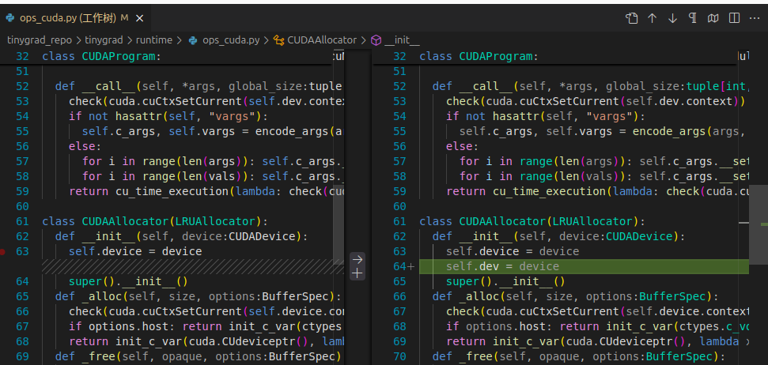

<div align="center" style="text-align: center;">
<h1>openpilot-pc</h1>
<b>在pc设备上运行sunnypilot </b>
</div>

* CPU比较强大
* 有NVIDIA的GPU
* 有AMD的GPU

<h3>
1. 环境安装
</h3>

参考 [webcam安装步骤](tools/webcam/README.md)

<h3>
2. GPU支持
</h3>
<h4>
NVIDIA
</h4>

安装驱动
参考[官方教程](https://developer.nvidia.com/cudnn-downloads?target_os=Linux&target_arch=x86_64&Distribution=Ubuntu&target_version=24.04&target_type=deb_local)

以下为官方教程精简:

```bash
# 确保安装的nvidia驱动是cuda12
sudo apt update
sudo apt install nvidia-cuda-toolkit
wget https://developer.download.nvidia.com/compute/cudnn/9.7.1/local_installers/cudnn-local-repo-ubuntu2404-9.7.1_1.0-1_amd64.deb
sudo dpkg -i cudnn-local-repo-ubuntu2404-9.7.1_1.0-1_amd64.deb
sudo cp /var/cudnn-local-repo-ubuntu2404-9.7.1/cudnn-*-keyring.gpg /usr/share/keyrings/
sudo apt-get update
sudo apt-get -y install cudnn
sudo apt-get -y install cudnn-cuda-12
```


按上图修改相应的文件和内容,之后`tools/op.sh build`编译,之后运行就行

默热配置的是`CPU`,按理说安装好相关`GPU`驱动会自动调用相应的`GPU`加速

<h4>
AMD
</h4>

参考官方教程


<h3>
3. 摄像机参数设置
</h3>

首先使用一些常规软件获取摄像头的内参参数(例如GMLCCalibration),主要是内参matrix矩阵
然后分别修改[camera.py](common/transformations/camera.py)和[ui.h](selfdrive/ui/ui.h)中相应摄像头的内参参数；另外根据自己的需求更改[camera.py](tools/webcam/camera.py)中的相机参数（像素和帧率，帧率最好是20的倍数，例如20,60）

<h3>
4. 数据分析
</h3>

参考 [juggler数据分析](tools/plotjuggler/README.md)

------
<div align="center" style="text-align: center;">
<p>
  <b>openpilot is an operating system for robotics.</b>
  <br>
  Currently, it upgrades the driver assistance system in 275+ supported cars.
</p>

<h3>
  <a href="https://docs.comma.ai">Docs</a>
  <span> · </span>
  <a href="https://docs.comma.ai/contributing/roadmap/">Roadmap</a>
  <span> · </span>
  <a href="https://github.com/commaai/openpilot/blob/master/docs/CONTRIBUTING.md">Contribute</a>
  <span> · </span>
  <a href="https://discord.comma.ai">Community</a>
  <span> · </span>
  <a href="https://comma.ai/shop">Try it on a comma 3X</a>
</h3>

Quick start: `bash <(curl -fsSL openpilot.comma.ai)`


[](https://codecov.io/gh/commaai/openpilot)
[](LICENSE)
[](https://x.com/comma_ai)
[](https://discord.comma.ai)

</div>

<table>
  <tr>
    <td><a href="https://youtu.be/NmBfgOanCyk" title="Video By Greer Viau"></a></td>
    <td><a href="https://youtu.be/VHKyqZ7t8Gw" title="Video By Logan LeGrand"></a></td>
    <td><a href="https://youtu.be/SUIZYzxtMQs" title="A drive to Taco Bell"></a></td>
  </tr>
</table>


Using openpilot in a car
------

To use openpilot in a car, you need four things:
1. **Supported Device:** a comma 3/3X, available at [comma.ai/shop](https://comma.ai/shop/comma-3x).
2. **Software:** The setup procedure for the comma 3/3X allows users to enter a URL for custom software. Use the URL `openpilot.comma.ai` to install the release version.
3. **Supported Car:** Ensure that you have one of [the 275+ supported cars](docs/CARS.md).
4. **Car Harness:** You will also need a [car harness](https://comma.ai/shop/car-harness) to connect your comma 3/3X to your car.

We have detailed instructions for [how to install the harness and device in a car](https://comma.ai/setup). Note that it's possible to run openpilot on [other hardware](https://blog.comma.ai/self-driving-car-for-free/), although it's not plug-and-play.

### Branches
| branch           | URL                                    | description                                                                         |
|------------------|----------------------------------------|-------------------------------------------------------------------------------------|
| `release3`         | openpilot.comma.ai                      | This is openpilot's release branch.                                                 |
| `release3-staging` | openpilot-test.comma.ai                | This is the staging branch for releases. Use it to get new releases slightly early. |
| `nightly`          | openpilot-nightly.comma.ai             | This is the bleeding edge development branch. Do not expect this to be stable.      |
| `nightly-dev`      | installer.comma.ai/commaai/nightly-dev | Same as nightly, but includes experimental development features for some cars.      |

To start developing openpilot
------

openpilot is developed by [comma](https://comma.ai/) and by users like you. We welcome both pull requests and issues on [GitHub](http://github.com/commaai/openpilot).

* Join the [community Discord](https://discord.comma.ai)
* Check out [the contributing docs](docs/CONTRIBUTING.md)
* Check out the [openpilot tools](tools/)
* Read about the [development workflow](docs/WORKFLOW.md)
* Code documentation lives at https://docs.comma.ai
* Information about running openpilot lives on the [community wiki](https://github.com/commaai/openpilot/wiki)

Want to get paid to work on openpilot? [comma is hiring](https://comma.ai/jobs#open-positions) and offers lots of [bounties](https://comma.ai/bounties) for external contributors.

Safety and Testing
----

* openpilot observes [ISO26262](https://en.wikipedia.org/wiki/ISO_26262) guidelines, see [SAFETY.md](docs/SAFETY.md) for more details.
* openpilot has software-in-the-loop [tests](.github/workflows/selfdrive_tests.yaml) that run on every commit.
* The code enforcing the safety model lives in panda and is written in C, see [code rigor](https://github.com/commaai/panda#code-rigor) for more details.
* panda has software-in-the-loop [safety tests](https://github.com/commaai/panda/tree/master/tests/safety).
* Internally, we have a hardware-in-the-loop Jenkins test suite that builds and unit tests the various processes.
* panda has additional hardware-in-the-loop [tests](https://github.com/commaai/panda/blob/master/Jenkinsfile).
* We run the latest openpilot in a testing closet containing 10 comma devices continuously replaying routes.

Licensing
------

openpilot is released under the MIT license. Some parts of the software are released under other licenses as specified.

Any user of this software shall indemnify and hold harmless Comma.ai, Inc. and its directors, officers, employees, agents, stockholders, affiliates, subcontractors and customers from and against all allegations, claims, actions, suits, demands, damages, liabilities, obligations, losses, settlements, judgments, costs and expenses (including without limitation attorneys’ fees and costs) which arise out of, relate to or result from any use of this software by user.

**THIS IS ALPHA QUALITY SOFTWARE FOR RESEARCH PURPOSES ONLY. THIS IS NOT A PRODUCT.
YOU ARE RESPONSIBLE FOR COMPLYING WITH LOCAL LAWS AND REGULATIONS.
NO WARRANTY EXPRESSED OR IMPLIED.**

User Data and comma Account
------

By default, openpilot uploads the driving data to our servers. You can also access your data through [comma connect](https://connect.comma.ai/). We use your data to train better models and improve openpilot for everyone.

openpilot is open source software: the user is free to disable data collection if they wish to do so.

openpilot logs the road-facing cameras, CAN, GPS, IMU, magnetometer, thermal sensors, crashes, and operating system logs.
The driver-facing camera is only logged if you explicitly opt-in in settings. The microphone is not recorded.

By using openpilot, you agree to [our Privacy Policy](https://comma.ai/privacy). You understand that use of this software or its related services will generate certain types of user data, which may be logged and stored at the sole discretion of comma. By accepting this agreement, you grant an irrevocable, perpetual, worldwide right to comma for the use of this data.
