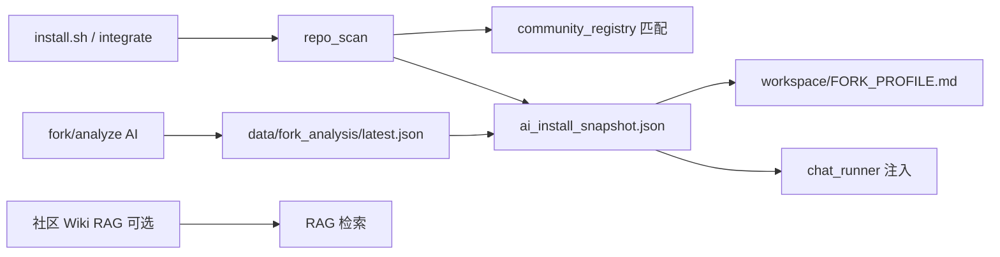

# 社区 Fork 与通用 op助手

op助手 是**通用型** openpilot 助手：不绑定单一社区，但应精通用户**当前安装树**上的 fork、设备与目录布局。

## 设计原则

| 原则 | 说明 |
|------|------|
| **检测优先于记忆** | 以本地 `git remote`、目录、`params_keys`、README 扫描为准，不靠硬编码猜版本 |
| **注册表是提示，不是真理** | `fork/community_registry.json` 列出常见社区（Dragonpilot、sunnypilot、FrogPilot 等），用于匹配 Wiki 链接与设备支持说明 |
| **安装即学习** | 每次 `integrate_openpilot.py` 成功后运行 `post_install_learn`，写入快照与 `workspace/FORK_PROFILE.md` |
| **深度分析可选** | 配置 LLM 后可用 Web「Fork 分析」或 `POST /api/ai/fork/analyze` 做全仓 AI 阅读（按 git commit 缓存） |
| **对话注入环境** | 聊天 system prompt 自动附带当前 fork/设备摘要（`fork_prompt.py`） |

## 数据流



## 支持的设备类

| 类别 | 说明 | 检测 |
|------|------|------|
| **C2** | comma two / EON-class Android | `comma_host.detect_comma_product()` → `device_class=c2` |
| **C3** | comma three (tici / F4) | devicetree `tici` |
| **C3X** | comma threeX (tizi / H7) | devicetree `tizi` |
| **C4** | comma four (mici / H7) | devicetree `mici` |
| **PC** | 开发机 | 默认 |

详见 [COMMA_DEVICES.md](COMMA_DEVICES.md)。

## 已知社区注册表

编辑 `ai/fork/community_registry.json` 可新增 fork（无需改代码）：

- dragonpilot / **d2**（C2）+ [dragonpilot_wiki](https://github.com/dragonpilot/dragonpilot_wiki)
- sunnypilot
- FrogPilot
- BluePilot
- IQ.Pilot（自托管 Git）
- commaai/openpilot（上游）

匹配字段：`remotes`、`marker_dirs`、`marker_files`（如 dragonpilot 的 `d2`）、`param_prefixes`（如 `dp_`、`Sp`）。

## 安装后产物

| 路径 | 内容 |
|------|------|
| `<openpilot>/ai_install_snapshot.json` | 结构化快照（分支、remote、设备、社区匹配） |
| `<openpilot>/workspace/FORK_PROFILE.md` | 人类可读的 fork 摘要 |
| `ai/data/fork_analysis/latest.json` | AI 深度分析（需 API + analyze） |
| `ai/data/fork_drafts/<slug>/` | 技能草稿（需 sync + 人工审核） |

## 用户 / 维护者操作

```bash
# 安装或更新后自动学习（integrate 已包含）
PYTHONPATH=$OPENPILOT_ROOT python3 ai/install/integrate_openpilot.py --root $OPENPILOT_ROOT

# 仅手动触发快照
PYTHONPATH=$OPENPILOT_ROOT python3 -c "
from ai.fork.post_install import run_post_install_learn
print(run_post_install_learn())
"
```

Web：**设置 → 开发 → Fork 分析** → 检测 / AI 分析 / 生成草稿。

## 与「精通全部社区」的差距（诚实说明）

1. **不能离线背下所有 fork** — 社区分支持续变化，靠**每次安装扫描 + 可选 AI 阅读**保持新鲜。
2. **Wiki 已支持运行时 ingest** — 支持 GitHub 仓库、**Discourse 论坛**（如 [sunnypilot 文档区](https://community.sunnypilot.ai/c/documentation/114)）、**MediaWiki**（wiki.gg）。install/启动/WiFi 时自动拉取；registry 中配置 `kind`：`discourse` | `mediawiki` | `repo` | `github_wiki`。
3. **C2 能力边界** — C2 无 AGNOS/TSK；部分工具（pandad_tici、C3 Lite beepd）不适用，AI 应依据 `device_class` 降级说明。
4. **新 fork** — 在 `community_registry.json` 加一条 + 用户跑一次 Fork 分析即可，无需 fork 官方配合。

## 相关 API

| API | 说明 |
|-----|------|
| `GET /api/ai/fork/detect` | 扫描 + 社区匹配 + 缓存分析 |
| `POST /api/ai/fork/analyze` | AI 全仓分析 |
| `POST /api/ai/fork/sync` | 生成技能草稿 |

## 社区 Wiki → RAG

| 时机 | 行为 |
|------|------|
| `integrate` / `post_install_learn` | 若匹配到 `wiki_repos`，拉取最多 30 篇 md 入 RAG |
| `aid` 启动 | 后台对当前 fork 再 ingest 一次（有缓存则跳过） |
| WiFi 定时任务 | `ingest_community_wiki_wifi`（默认每 6 小时，连 WiFi 时） |
| 手动 | `POST /api/ai/rag` `{"operation":"wiki_ingest"}` 或工具 `sync_community_wiki` |

实现：`ai/fork/wiki_ingest.py`。缓存：`ai/data/wiki_cache/<slug>/manifest.json`（按 git tree sha 增量）。

Dragonpilot：[dragonpilot_wiki](https://github.com/dragonpilot/dragonpilot_wiki)（**master**，约 57 篇 md；registry `max_files: 80`）。**仅 fork 匹配 dragonpilot 时**自动 ingest；在 sunnypilot 等仓上需 `sync_community_wiki(all_registered=true)`。

其它社区：sunnypilot [community 文档区](https://community.sunnypilot.ai/c/documentation/114)（Discourse）+ [user-docs](https://github.com/sunnypilot/user-docs) + [sunnylink-wiki](https://github.com/vinnie291/sunnylink-wiki)；FrogPilot [frogpilot.wiki.gg](https://frogpilot.wiki.gg/)；BluePilot / CarrotPilot 见 registry。comma 官方 Wiki 仍以内置 `wiki_rag_pages.py` 为主。

## 扩展路线图（建议）

- [x] Wiki 增量 ingest（GitHub / Discourse / MediaWiki）
- [ ] openpilot 主仓 `git pull` 后 hook 自动 `post_install_learn`
- [ ] 社区 Param 目录自动生成只读「参数护照」
- [ ] IQ.Pilot 等自托管 remote 的 SSH/HTTP 规范化匹配
