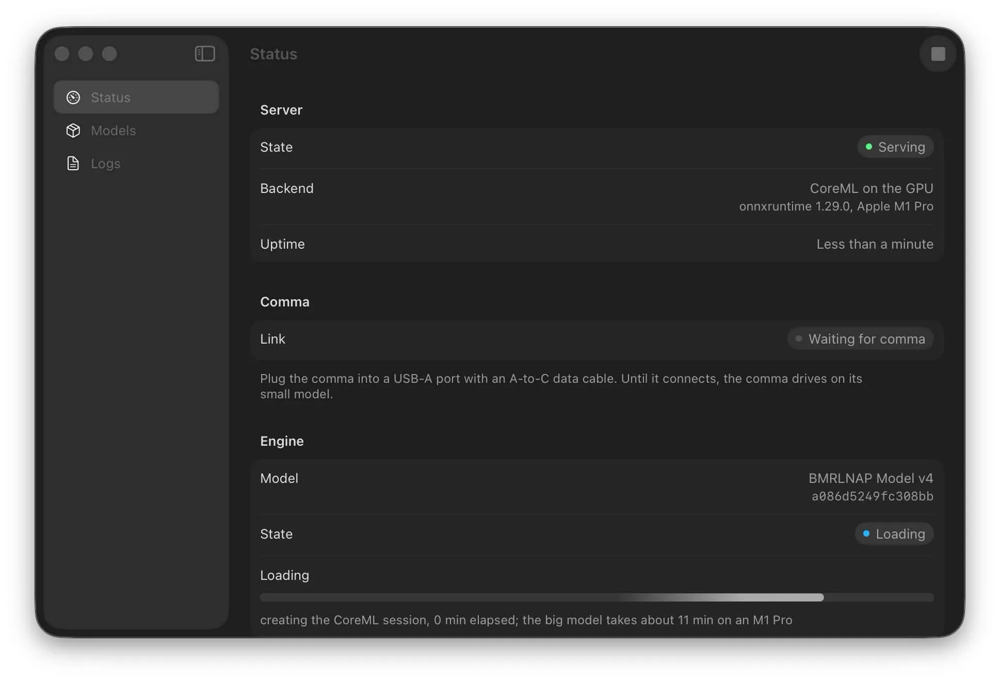
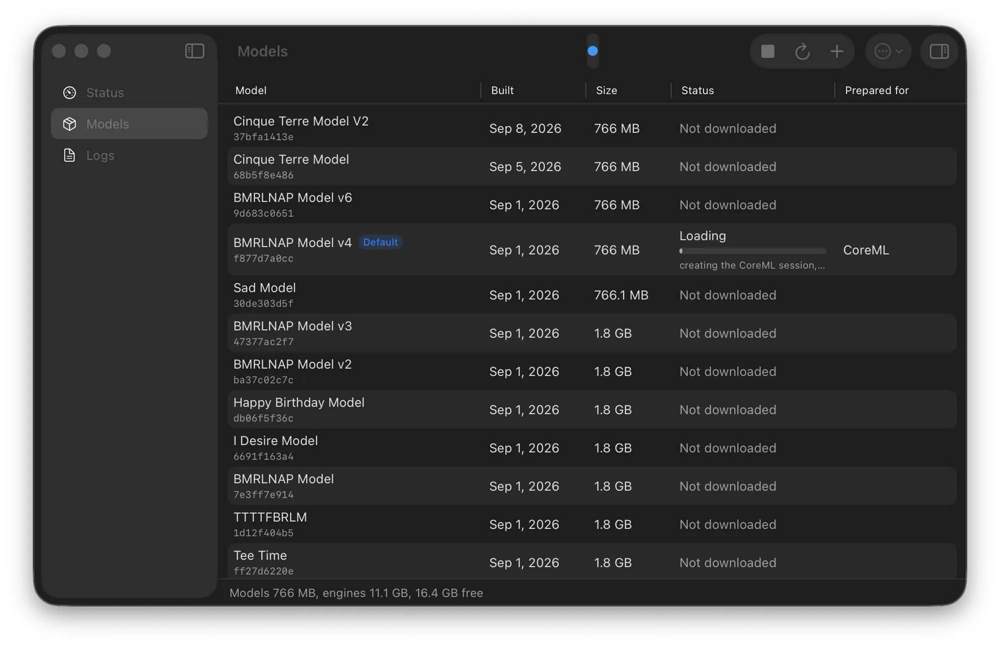
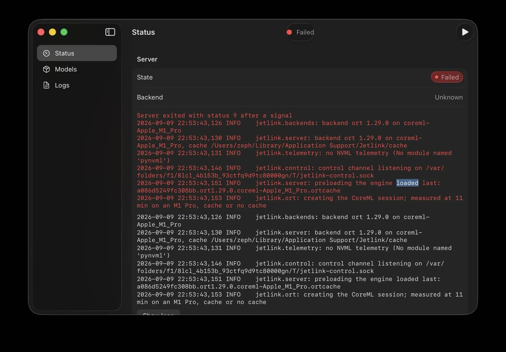

# Jetlink for Mac

Runs the server with no terminal commands. Jetson: [Jetson guide](jetson.md).
Command line on any platform: [platform setup](platforms.md).

## Requirements

- An Apple silicon Mac on macOS 15 or later. Intel Macs are not supported.
- 16 GB of memory recommended, and about 3 GB of disk per model.
- A USB 3 USB-C cable, or a USB-A to USB-C cable with a USB-C adapter.
- A comma running a zoompilot build with Jetlink, set up per the
  [README](../README.md#quick-start).

## Install

Set up outside the car or in the car while offroad. Keep the comma and Mac
online, and the Mac powered and awake.

1. Download the Mac DMG from [Releases](https://github.com/zoompilot/jetlink/releases).
2. Drag Jetlink to Applications.
3. Open Jetlink. The server starts and Status says **Waiting for comma**.

## Plug in

1. Complete [comma setup](../README.md#comma-setup-all-platforms), with
   **Accelerator Link** set to **USB**.
2. Connect the **Mac to the comma** with a USB 3 USB-C cable, or a USB-A to
   USB-C cable with a USB-C adapter. A USB 2 cable costs about 10 ms a frame.

Status (and the menu bar) then shows:

| Row | What you want |
| --- | --- |
| **Link** | **Connected over USB 3**. **USB 2** is a warning: use a USB 3 cable and port. **TCP** shows the client's address. |
| **Rate** | Near 20 frames per second. |
| **Slow frames** | Zero (frames over 60 ms in the last second). A steady count means the Mac is too slow, and the comma may fall back to its small model. |
| **Frame budget** | At least 10 ms to spare. See [performance measurements](mac-performance.md). |

On the comma, the home-button icon pulses while the model loads, then turns
green. Driving: [daily use guide](using-jetlink.md).

A network service named **jetlink** in System Settings > Network means the
comma's **Accelerator Link** is on **iOS** (for iPhone). Set it to **USB**.

## Everyday use

- Keep the Mac powered and awake.
- Closing the window keeps the server and menu bar icon running. Quitting stops the server.
- The next launch uses the same model.

## Use a model before you drive

Optional. Otherwise the comma sends its model on connect and drives on its
small model until the Mac has prepared it.

- **Default model:** click **Use** next to its name on Status. One click
  downloads, prepares and uses it.
- **Another model:** open **Models** (the same list, in the same order, as
  **Settings > Models > Big Model** on the comma). Click **Use Model** or
  double-click the row. The row shows the download, the preparation, then **In Use**.
- The cancel button next to a download stops it.
- Right-click a model for **Stop Using Model**, **Show in Finder**, and
  deleting its download or prepared engines. **Inspector** (Command-I) shows its
  checksum, files and engines.

| Under the model's name | Meaning |
| --- | --- |
| Date and size only | Not downloaded. Use Model downloads it first. |
| Downloaded | Not prepared. Use Model prepares it. |
| Prepared for CoreML | Use Model only loads it. |

On an M1 Pro, preparing takes about 20 seconds. Loading takes under a second
for the last model loaded, up to about 10 seconds otherwise.

App screenshots

From an earlier app build.

## Settings

**General**

| Setting | What it does |
| --- | --- |
| Start server when Jetlink opens | On by default. |
| Open Jetlink at login | Adds a login item, so Jetlink runs before you get in the car. |
| Keep the Mac awake while serving | Prevents idle sleep on power. On battery, keep the lid open. |
| Cache folder | Models and prepared engines (a CoreML engine is about 2 GB). Takes effect on server restart. |

The cache folder defaults to `~/Library/Application Support/Jetlink/cache`. To
reuse what a terminal server downloaded and prepared, point it at that folder
with **Choose…**.

**Server**

| Setting | What it does |
| --- | --- |
| Backend | See [Backends](#backends). |
| Connection | **USB (the comma)** for driving, **TCP** for testing without a comma. |
| Port | The TCP port, 5599 by default. TCP only. |

Click **Restart Server** to apply.

### The server

The Swift server every platform runs, built in. It opens the comma's USB link
through macOS's USB framework, or listens on the TCP port for a bench client.

- **Benchmark** (Command-3) runs the loaded model at the comma's pace on the Mac
  alone, with the iPhone app's verdict, while no comma is connected.

## Backends

- Leave **Backend** on **Automatic** (fastest).
- If another app keeps the Neural Engine busy and Jetlink slows, pick **CoreML
  on the GPU** (about a third slower on an M1 Pro).
- If you picked **CoreML on the GPU** before, select **Automatic** to switch back.

[Backend measurements](backends.md#mac-measured).

## Troubleshooting

| Problem | What to do |
| --- | --- |
| The server failed to start | Open **Logs**: the last lines say why. Usually another server holds the USB device (a `jetlink-server` in a terminal, say), or the cache folder is not writable. |
| Stays on Waiting for comma | Use a USB 3 data cable, or a USB-A to USB-C cable with a USB-C adapter. Check **Accelerator Link** is **USB** under Settings > Models on the comma. |
| Use Model takes a long time | Expect about 20 seconds to prepare and up to 10 to load. If it takes minutes, right-click the model in **Models**, choose **Delete Prepared Engines…**, and use it again. Close large apps to free memory. |
| The comma says **Big model lost** | Check the cable. Turn on **Keep the Mac awake while serving** and keep the Mac on power. |
| Everything rebuilt after an update | Expected: a new runtime prepares the model again. The download is kept. |
| The model list is empty | Connect the Mac to the internet, then choose **Refresh** in **Models**. |
| Slow frames, or rate below 20 | Check the cable and port. If another app is using the GPU or Neural Engine, choose **CoreML on the GPU** under Settings > Server. |

Example server error

## Where things live

| What | Where |
| --- | --- |
| Models and prepared engines | `~/Library/Application Support/Jetlink/cache`, or the cache folder you chose |
| Server log | `~/Library/Logs/Jetlink/server.log` |
| The app | `/Applications/Jetlink.app` |

To uninstall, quit Jetlink and delete `/Applications/Jetlink.app`,
`~/Library/Application Support/Jetlink` and `~/Library/Logs/Jetlink`. If you
turned on **Open Jetlink at login**, remove it in **System Settings > General >
Login Items**.

## For developers

- Building, signing and notarizing: [Mac developer guide](../macos/README.md).
- The same server as a command: [from a terminal](platforms.md#from-a-terminal).
- Scripting: [model CLI](model-cli.md), [control protocol](control-protocol.md).
